# B站杂学

- 股市翻倍的秘密
  - 逻辑（行业政策的龙头股） + 资金（主力大资金入场） + 技术（什么时候卖什么时候卖） = 稳定盈利

- 突破
  - 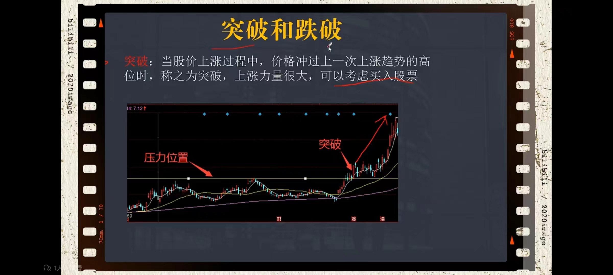
- 跌破
  - 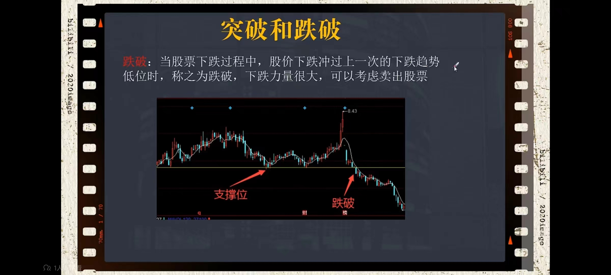

## 上影线和下影线

- 高位出现上影线和下影线都赶紧跑路！
  - 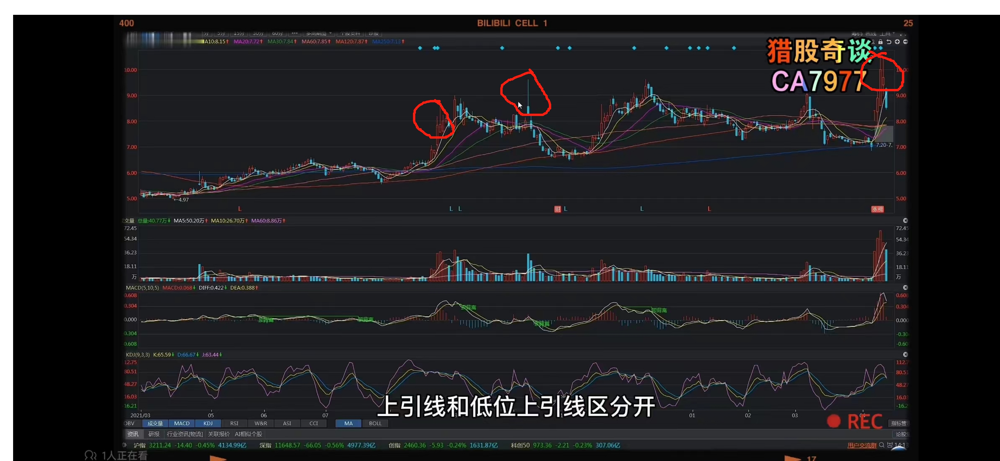
  - 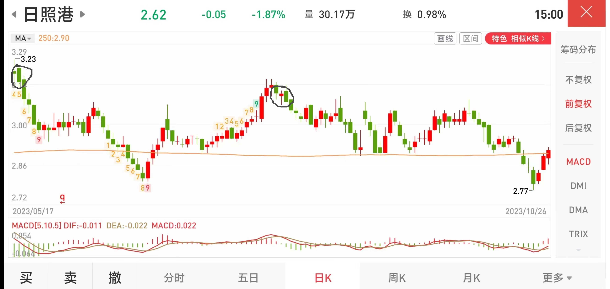

- 低位出现上影线或者下影线代表未来几天股票会上涨

## 断线MACD老鸭头图形，立即购买，未来几天肯定上涨

- MACD设置5-10-5
- 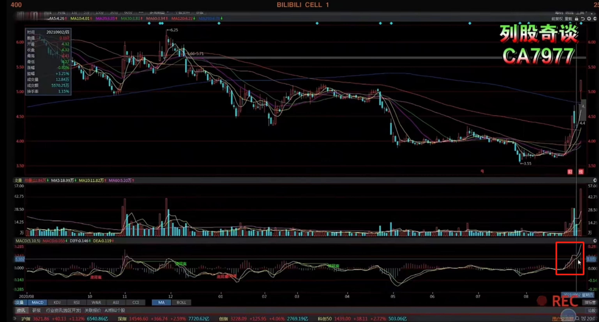

- MACD亮线代表涨跌幅度
  - MACD设置5-10-5
  - 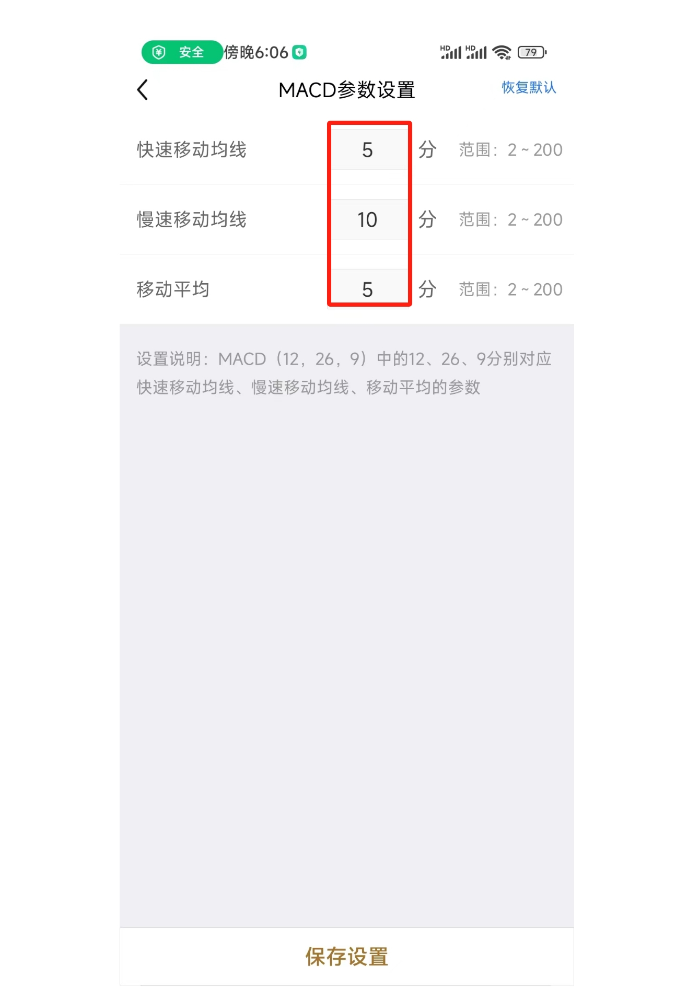

## 判断主力是否出货

- **高位放量且大阴线！**主力出货赶紧跑
  - 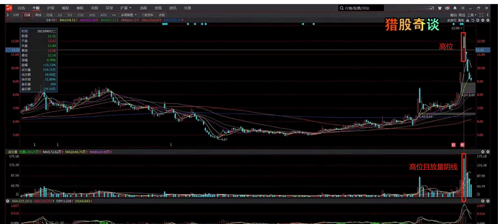

## 换手率

- **超过60%就要坚决卖掉！**
- **买换手率大于3%的股票**，换手率太低的话，一年涨幅过低，意义不大！
- 次新股除外
- 股盘在1-20亿之间，换手率在2%-5%
- 低于1个亿，换手率在8%-15%

## 均线粘合

- 60,120,250均线粘合再一起，那么接下来一定会做方向选择，向上或者向下不确定，结合上下文具体分析
  - 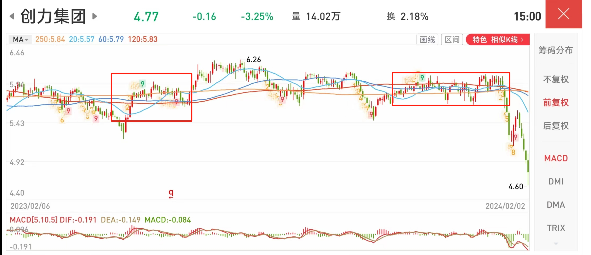

- 缩量粘结，粘结后需要放量后面才会上涨
- 止损控制是60日均线位置

## 游资拉盘前经典吸盘，散户经常提前下车（拉伸前砸坑）

- 短期横盘2个月到4个月，**游资往下砸盘，成交量必须是缩量**,缩量表示没人卖了！
  - 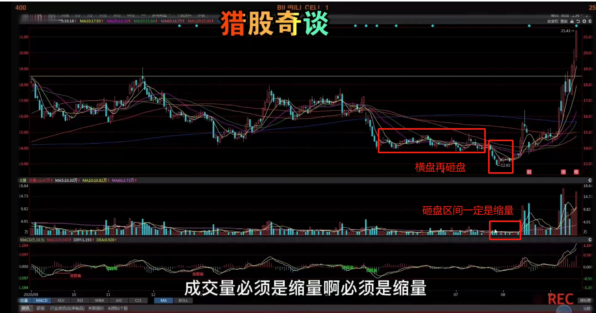

## 跳空缺口

- 向上
  - 当出现跳空缺口时，说明股价很强势。
- 向下
  - 后期暴跌

## 底部形成W底部

- 局部形成W底部，**第二个V底部值一定要大于第一个V底部这样等价格破颈线才可以买入**
- 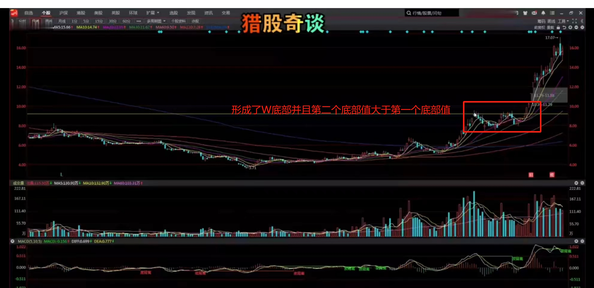

## 60日均量线

- 均线设置5,10,60，当5,10均线长期在60均线下方时，一般行情是横盘震荡。

- 当5,10上穿60成交量均线的时候，买点，反之，卖点。当然还需要结合其他技术指标一起判断是否买卖！

  

## 换手率定方向，买卖盘定买点

- 外盘（买家）超过内盘（卖家）2倍

- 当日分时在均价之上，且幅度超过3个点
- 涨停板除外
- 注意大盘情况
- 个体本身有箱体突破或者突破前高最佳

## 生命线

- 股价在120日均线以上进行回踩，且高于3%个点或者至少在均线上面3日以上才可以买入

## 波浪理论

- 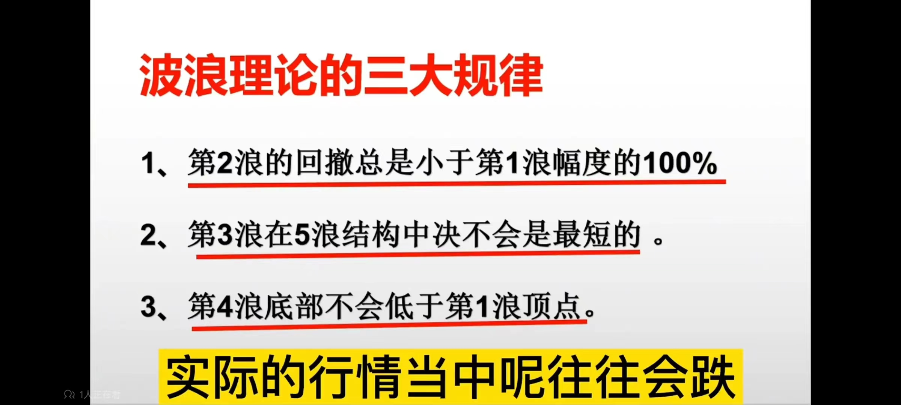

- 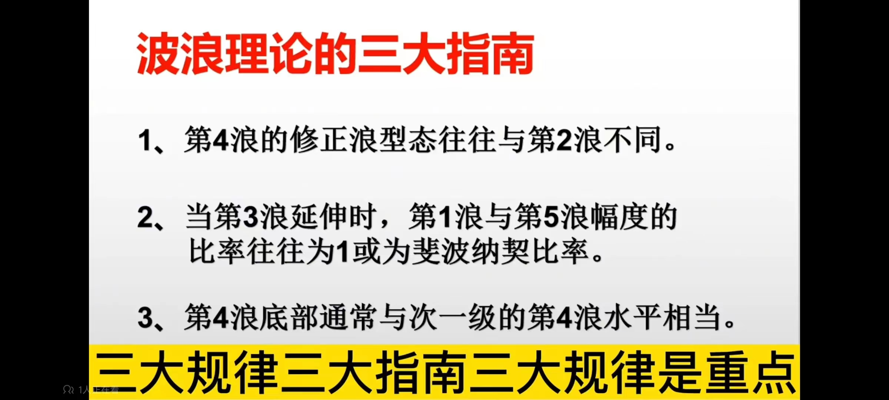

- 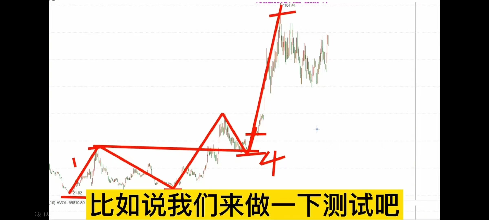

## 上证50ETF

- | 重仓股票 |
  | -------- |
  | 中国平安 |
  | 贵州茅台 |
  | 伊利股份 |
  | 招商银行 |
  | 兴业银行 |
  | 长江电力 |
  | 恒瑞医药 |
  | 紫金矿业 |
  | 中信证券 |
  | 工商银行 |
  | 五粮液   |

  

## 拉大盘4辆马车

- 消费
- 金融
- 中字头
- 各个行业18茅

## 行业龙头股

- 消费行业
  - 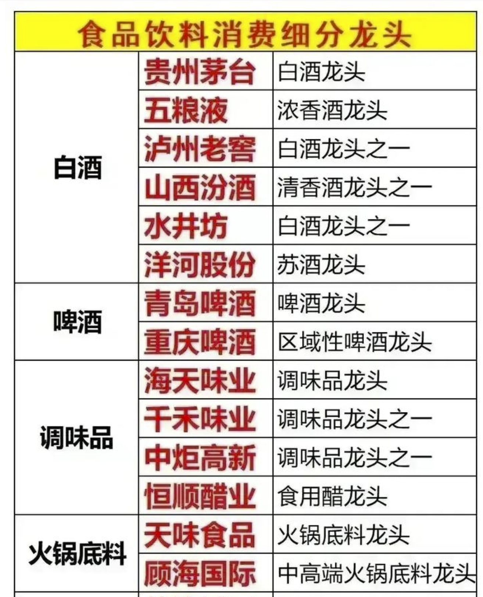
  - 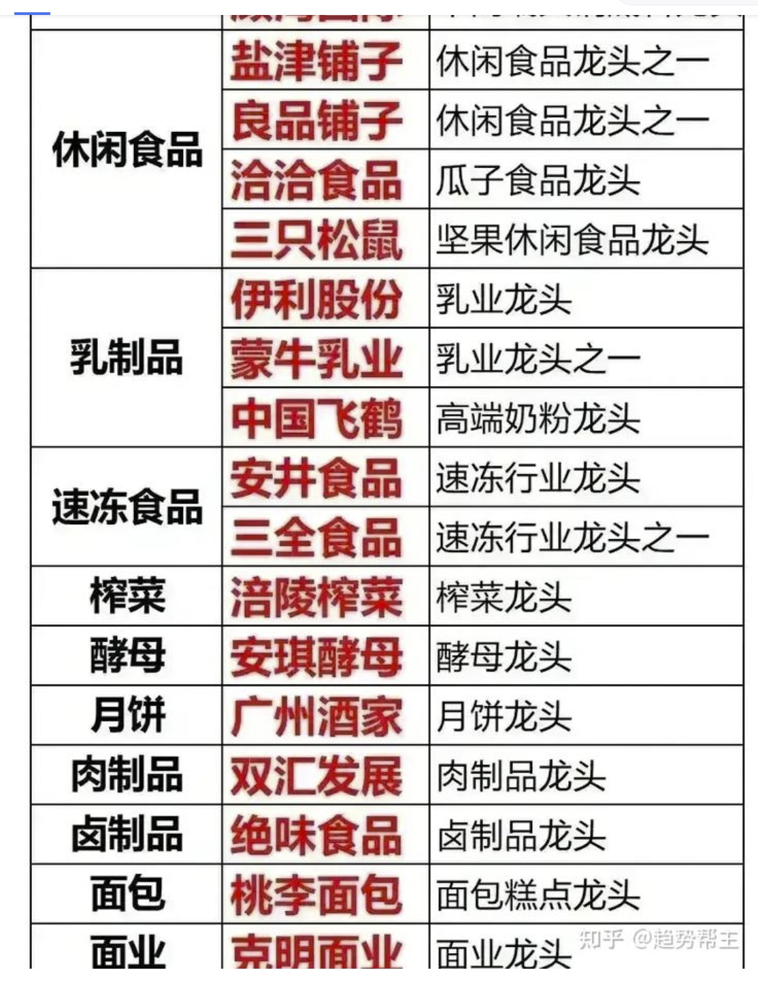
  - 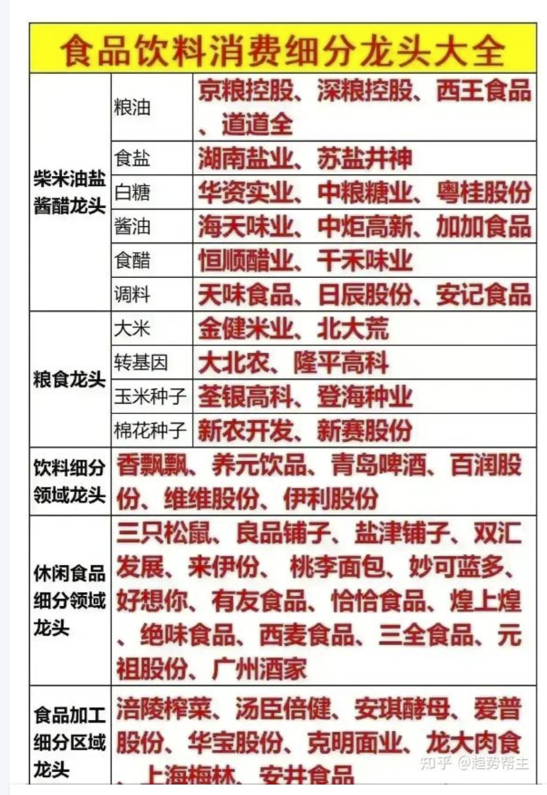

- 金融行业
  - 中国平安：国内保险巨无霸
  - 中国人寿：也是保险巨头
  - 招商银行：经营能力最强的零售型股份制银行
  - 宁波银行
  - 中信证券：国内券商第一霸主
  - 中投建设：A股第二个市值证券公司
  - 东方财富：互联网金融证券龙头股
  - 华泰证券
  - 招商证券
  - 同花顺：最大网上证券交易系统供应商
  - 兴业银行
  - 工商银行
  - 交通银行
  - 江苏银行
  - 农业银行
  - 民生银行
  - 海通证券
  - 恒生电子

## 国家政策消息网站

- 查看国家政策消息网站
  - 国家统计局 CPI PPI 找涨价的题材 再结合基本面和技术面分析
  - 国家发改委 国家政策方针
  - 海关总署 进出口
  - 人民银行

- 通过国家政策解读，找到未来发展方向
- 大方向选分支，行业
- 细分到个股，分别是做啥的
- 持续跟踪，跟踪行业的消息，有没有利好的消息