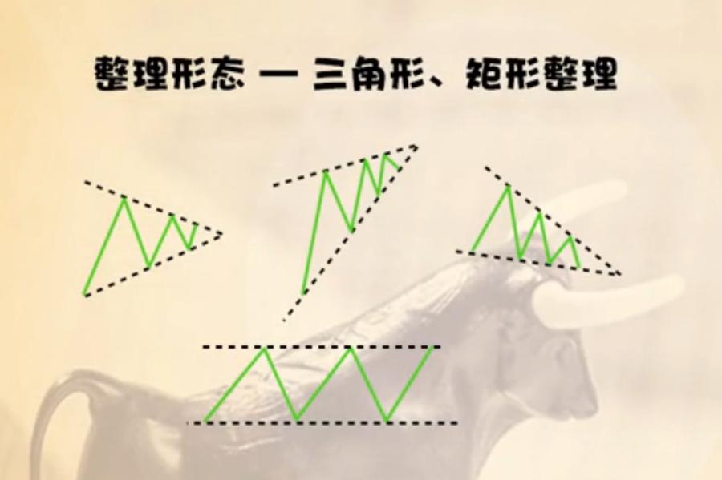
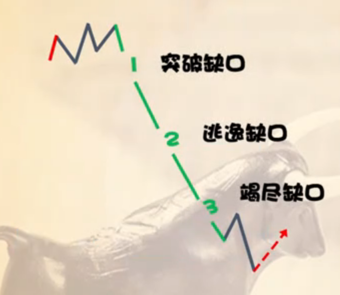

# 证券投资学

[概念](#概念)

[理念与框架](#理念与框架)

[证券家族四兄弟](#证券家族四兄弟)

- [债券](#债券)
- [股票](#股票)
- [基金](#[基金](#债券))
- [期货期权](#期货期权)

[投资战场](#投资战场)

- [警惕买入卖出坑](#警惕买入卖出坑)
- [股票估值](#股票估值)
- [牛熊判断](#牛熊判断)
- [股票定价](#股票定价)

[选股神器](#选股神器)

- [基本分析](#基本分析)
- [技术分析](#技术分析)

- [相对估值法](#相对估值法)

- [如何选择哪种估值方法](#如何选择哪种估值方法)
- [股票估值看宏观](#股票估值看宏观)

- [市盈率与股票估值](#市盈率与股票估值)
- [静态市盈率和动态市盈率](#静态市盈率和动态市盈率)
- [股票估值看垄断，盈利需要护城河](#股票估值看垄断，盈利需要护城河)
- [粗看股票看什么](#粗看股票看什么)
- [上班族如何投资](#上班族如何投资)

[看趋势选股](#看趋势选股)

- [压力与支撑](#压力与支撑)
- [底部形态](#底部形态)
- [顶部形态](#顶部形态)
- [缺口理论](#缺口理论)

- [K线分析](#K线分析)
- [看股票一定要看完整k线](#看股票一定要看完整k线)

[交易系统](#交易系统)

- [找底部放量的小姑娘](#找底部放量的小姑娘)

[自己的交易系统](#自己的交易系统)

[长颈鹿课堂](./长颈鹿课堂/长颈鹿课堂.md)

[B站杂学](./B站杂学/B站杂学.md)

[游资大侠](./游资大侠/游资大侠.md)

[大爷投资](./大爷投资/大爷投资.md)

# 概念

- 大宗交易
  - 是指数额较大的证券交易，经买卖双方私下达成一致协议并经交易所达成买卖的**交易方式**。A股单笔交易数量在**30万股（含）以上**，或交易金额在**200万元（含）人民币以上**的，都需要进行大宗交易。
- 一级市场和二级市场
  - 一级市场的交易主体主要是上市公司和投资者，而二级市场的交易主体主要是个人投资者和机构。
  - 交易方式
    - 一级市场是一次性标价进行交易，而二级市场可以进行多种价格交易。
    - 流动性；二级市场流动性更好
    - 信息透明度：一级市场是非公开的，具有一定的不透明性，而二级市场是公开的，市场情绪可以被投资者利用。
    - 用途：一级市场用于股票发行，二级市场用于股票交易流通，是已上市公司的股票交易场所。
- 持续放量
  - 一段时间内，股票的**成交量**相比于之前出现了持续的暴涨
- 量价齐升
  - 股票价格和成交量都升高
- 股票标记**融**字
  - 表明该股票可以进行融资融券，可以做多或者做空
- L1 &  L2标记的股票
  - L1是每隔6s刷新一次数据
  - L2每隔3s刷新一次
- 股票在哪里上市
  - 科创板上市
    - 688
      - 50w以上的资产才可以购买
  - 沪市主板上市
    - 600/601/603/605
  - 深市主板上市
    - 000
  - 深市中小板上市
    - 002
  - 创业板
    - 300
    - 涨跌幅限制20%

## 理念与框架

策略：牛市满仓睡大觉，熊市空仓买基金

传统牛市特点：

- 牛市时，所有股票都要涨一次，只是有早晚的区分而已

- 熊市时，早跌晚跌，所有股票迟早要跌
- 牛短熊长

**熊市的时候空仓买货币基金**

交易系统：

- 买什么
- 什么时候买
- 买了过后怎么办

交易系统第一招

- 止损，短线5%；长线30%

## 证券家族四兄弟

### 债券

- 概念：政府获取企业向投资人开具的借条，规定了期限还本利息
- 时间分类
    - 短期：风险低，收益低
    - 中期
    - 长期
- 发行人分类
    - 政府债券
        - 信用最好，收益低
    - 普通企业债券
        - 收益最高
    - 金融企业债券
        - 信用好，收益比政府债券高
- 投资策略
    - 熊市买债券
    - 债券基金优于债券，流动性强

### 股票

- 挣多少钱算多？
    - 无风险收益能挣多少？ 
        - 参考3-5年期国债，一般是4%，超过6%的很可能是骗子。
    - 上市公司能给咋多少钱?
        - 工商银行最正确，14.7%,但是他一般分给股民6%
    - 巴菲特能挣多少钱？
        - 年化率20%
    - 如果追求暴利会有什么风险？
        - 建议年化收益率6-7%
- 怎么挣钱
    - 分红
    - 资本利得：低买高卖

### 基金

- 分类
    - 货币基金
    - 债券基金
    - 股票基金
    - 混合基金
- 什么时候买？
    - 牛市：全仓
    - 熊市：买货币基金，债券基金
- 长期定投宽基指数基金

### 期货期权

- 富贵险中求
- 期货交易：猜对了赚钱，猜错了赔钱；加杠杆，以小博大。
    -  开仓：交保证金，签订买卖合约
    - 平仓：将合约平掉，全额结算
    - 多单：看价格要涨，开仓买入，平仓卖出
    - 空单：看价格要跌，开仓卖出（从期货交易所借商品，卖出），平仓买入（把商品买回，还给交易所）

## 投资战场

如何保护自己的权益

- 不要碰明星股

证券发型市场

- 发行方式：公募和私募，直接发行和间接发行，代销和包销
- 证券公司：媒婆+婚庆公司
- 发行门槛和发行价格：发行门槛就是发行条件；我国主要采用市盈率法

注册制

- 只要符合条件的就可以上市，不符合就退市，不用向核准制那样
- 由监管部门审批，因此会增加上市公司数量
- 能够抑制住爆炒新股的人。市场最终能够留下好公司。牛场熊短将不再是梦。

上市公司是如何割韭菜的？

- 回购：上市公司看到股票价格不行，用公司的利润购买会一部分股票，之后注销那部分股票。从而保证股票价格。**但是现在很多公司购买了自己股票不是注销而是等着高点卖出，就是割韭菜！**
- 增发股票：拿着投资者的钱不去发展公司业务，壮大公司，而是去做别的呢。
- 铁公鸡：没有分红

证券交易所

- 有价证券的拍卖市场；会员主要有经纪人和交易商

停牌和摘牌

- 停牌：停止交易
- 摘牌：取消上市公司资格

### **警惕买入卖出坑**

现金流贴现法

- 股票预期的现金流折现成现值，测算股票内在价值。

### **股票估值**

复权

- 高转送股票常常被主力视作出货的工具
- 前复权
- 后复权
- 尽量还是别选除权的股票

### **牛熊判断**

- 牛市：一年以上的长期上涨的行情
- 体现为**上证指数**的涨跌，上证指数是反应市场大趋势的公认指标
- 牛市是几乎所有的商品打折出售。

### 股票定价

- 市盈率定价：我国主要是市盈率定价
- 净资产定价
- 市场竞价

## 选股神器

### **基本分析**

- 目的：估值 -》低买高卖
- 基本分析看价值，适合选股
- 看什么：宏观、行业和企业。给股票正确估值。

### **技术分析**

- 技术分析观趋势，适合判断牛熊

绝对估值法

- 贴现，预期现金流进行折现判断

### 相对估值法

- 同行业股票进行对比估值
- 通过市盈率(P/E),市净率（P/B）进行估值

### 如何选择哪种估值方法

- **重资产企业**（传统制造业）：以**市净率**估值为主，盈利估值方式为辅
- **轻资产（服务型行业）**：以**盈利估值**方式为主，净资产估值为辅
- **新兴行业，高科技行业**：以**市销率**（市值与销售量）为主

### 股票估值看宏观

- **大政方针**：会影响股票估值，短期可能暴涨，长期影响也需要关注
- **经济周期**：股票指数是经济周期的先行指标，部分行业不受影响
- 反周期政策：处理经济周期，使得对股票估值不要那么悲观

### 市盈率与股票估值

- 市场价格与每股价格的比例
- 每股盈利是企业纳税后，每股挣多少钱
- 市盈率=市场价格/每股收益（P/E）;市盈率越低，企业挣钱能力强;**每股收益一般指的是上一年的数据**
- 公司通过多少钱能够收回成本; eg: 12.75/1.85 = 6.9;也即是公司6.9年能够收回成本。
- 市盈率越低，股价越低估
- 高成长股票，市盈率会快速下降，因为每股收益在增加。高成长的股票30倍左右也就可以接受的。
- **老年期企业不能看市盈率；要看市净率**（煤炭，水泥，钢铁）**股票估值看宏观**
- 市净率：市场价格/每股净资产（P/B）；市净率<1的时候可以买入
- 净资产：总资产-借的钱

### 静态市盈率和动态市盈率

- 静态市盈率：以去年数据为参考来估值
- 动态市盈率：预测未来

企业对股票价格的影响

- 高估值源于垄断
- 保护高估值需要护城河：有自然条件专利品牌，初始投入高，顾客转换成本高
- 如何加固护城河：需要工匠精神，防止跨界打击，有杰出领导人。

### 股票估值看垄断，盈利需要护城河

- 给股票估值必须要考虑护城河
- 高估值必须要依赖于护城河
- 护城河：自然条件因素，品牌专利，初始投入高，顾客准换成本高
- 加固护城河：需要工匠精神；防止跨界打击；具备接触领导人；

### **粗看股票看什么**

- F10打开
- 市盈率是多少
    - 是否是高成长行业：市盈率是30,40倍都是可以接受的
    - 成熟行业：在15倍左右是合理的，如果是在牛市20倍是可以接受的
    - 衰退行业：10倍以下是可以接受的
- 每股收益多少
- 巴菲特三个指标判断企业是否是优秀企业：
    - 毛利率：销售利润/销售收入； **20%以上就不错了**
    - 净利率:**5%以上就不错**
    - 净资产收益率：资产-负债；**15%以上就不错**
- 看k线图：月k线
    - 是不是处在价格的历史低位
    - 看日k线和周k线：是否形式w或者圆弧或者头尖形状底部
- 做什么的？卖什么东西
- 竞争对手是谁
- **竞争对手的股价是多少**
- 仔细的看：看财务报表

### **上班族如何投资**

- 上班族应该投资：各个行业风水轮流转，你不可能经常换行业，因此需要投资来享受到行业带来的福利

- 三个原则
    - 不要因为投资而影响主业
    - 注意仓位管理，不要把全部收入放入股票
    - 心态平和，建立交易系统
- 上班族投资的几个机会
    - 牛市机会：选低估股票买入即可，
    - 中线趋势：暴跌了很长时间，**熊市反弹，大概持续一个月**
    - 把握行业机会
    - 观察生活中的细节

## 看趋势选股

技术分析三大假设

- 市场包容一切
- 市场是有趋势的
- 历史是经常重复的

证券市场有长期，中期，短期趋势

### 压力与支撑

- 压力：**股价上方的一个价格位**，当股价运行到这个价格的时候，遇到**巨大的卖盘**。

    - 
    - 亚历山大必转熊

- 支撑：股价下方的一个价格位，**当股价运行到这个价格的时候，会遇到巨大的买盘**，阻止价格下跌。

    - 

    - 支撑多多必转牛

- 趋势线

    - 

- 整理形态

    - 

### 底部形态

- 
- 什么时候买：底部形成W底，并且在右侧交易，价格突破颈线10%. 一般来说站稳颈线即可。
- 

### 顶部形态

- 

### 缺口理论

- 
- 

### K线分析

- 阴线

    - 

- 阳线

    - 

- 同价线

    

- 日线猜大盘

    - 
    - 中长线选股：看周，月K线
        - 
    - 展望未来
        - 

##### 组合k线3态

- 强弩之末k线组合
    - 概念：连续行情要结束了！连续行情+同价线
    - 
    - 
    - 
- 转向的k线组合
    - 概念：连续行情要转向；连续行情 + 同价线 + 反向k线；连续行情 + 反向k线
    - 
    - 
    - 

- 反转的k线组合

    - 概念：跌转涨或涨转跌；**成交密集区的跳空缺口；k线组合的底部和顶部**；

    - 
    - 

- 移动平均线(MA)
    - 

技术分析可以归纳成图形分析和统计分析

技术分析（查尔斯道是鼻祖）

- 图形分析
    - 形态论
        - **压力**（卖方）与**支撑**（买方）
        - **趋势**
        - **底部**与**顶部-**> **反转**形态
- 统计分析
    - 移动平均线
    - 统计指标（趋势指标+动量指标+人气指标）

**压力山大必下跌**

**支撑多多必上涨**

整理形态：描述趋势上下振动的图形，它也有方向

技术选股：找筑底的股票

- 头尖顶，也就是M形状的图形一旦形成，未来一定会有大跌趋势。

波浪缺口，细化趋势

- 波浪理论
- 缺口理论
    - 
    - 
- 其他理论

移动平均线：MA

- 平均价格连线

- 用处：

    - 金叉：价格上穿均线，短期均线上穿长期均线，可以买入（**理论**）

    - 死叉：价格下穿均线，短期均线下穿长期均线，卖出（**理论**）

        

    - 特点：滞后性和稳定性

    - 大趋势看，股价越高，金叉未必有用；股价低估，死叉也未必有用。

### 看股票一定要看完整K线

- 从底部11.08 ->27.49 已经涨了1.5多，后面再从18.36涨上去给套牢盘解套比较困难。而且到了27.49得站稳得1周才算站稳，不然会下跌。

## 交易系统

大概率挣钱的时候再去投资，不然就是赔钱！

### 找底部放量的小姑娘

- 一般用周线来找

- 小姑娘：低估的股票

    - 如何找低估的股票
        - 市盈率=股价/每股收益，**低于10倍最好，低于15有吸引力**
        - 静态市盈率的每股收益是去年的年报，动态市盈率是年末的年报
        - 发行价：次新股（上市两年内）跌破发行价或者附近，就算是低估。次新股比较靠谱，通过证监会的审核，财务状况合格，一般3年内，次新股不会变脸。
        - **年线历史低位走平**：年线是250天移动均线，是年平均成本。如果年线在历史低位长期走平，也是低估的表现。
        - 月k线：如果月k线在低位横盘超过8根，越多越好，那么也是低估的表现。
        - 暴跌50%以上：大资金才会进入拉盘，可以挣100%。

- 底部放量很重要

    - 底部放量：**股价在历史低位成交量放大**
        - 换手率（**换手是指股价上涨了一段行情以后,低价买进的投资者抛出股票获利了结**）：比平时高3倍左右，平时2%，突然就6%。
        - **或者观测到成交量放大几倍。**
        - **长期横盘，至少半年以上.**

- 小姑娘的左右侧交易

    - 左侧交易：风险大，挣钱多
    - 

    

    - 右侧交易：风险小，挣钱少，有时候赶不上车
    - 
    - **个股暴涨以后,会熊3年,3年之类不要碰!!!** **大资金进来以后,股票至少得涨个2倍他才赚钱.**

左侧交易和右侧交易

- 左侧交易准则: 有助跑空间
    - 
    - 左侧交易还可以根据市场估值来判断是否可以进场，前提是了解市场的情况下。
- 右侧交易：
    - 需要有上涨空间
    - 

牛市买什么？

- 
- 什么时候卖出
    - 

## 传统牛市和新型牛市

核准制：牛短熊长

注册制：符合标准就上市，2020年7月1日，创业板实行注册制；注册制有利于优胜劣汰，是成熟市场的标志。

新型牛市特征

- 有大象级别的股票负责拉大盘
- 牛长熊短
- 中小盘股票涨跌和大盘无关
- 可能会有仙股（股价低于1元）

​	

## 技术指标

- 集合竞价
    - 每天早上9:15--9:25分是早盘集合竟价时间,多的不说,但集合竟价这段时间内有一个最重要的原则就是数量优先,直白点就是说,集合竟价谁参与筹码多谁就能决定开盘价,谁有的筹码多呢?那不就是主力、机构和庄家吗。所以主力对股票的开盘价拥有绝对的定价权,这是主力能够操纵股票走势的核心手段.
- MACD
    - 是一种趋势
    - 顶背离和底背离
    - 
    - 
    - DIFF（DIF）
        - 快线
    - DEA
        - 慢线
    - 0轴线
        - 
    - 金叉
        - **快线DIFF上穿慢线DEA形成金叉**
        - 如何买：
            - 零轴线下方：当零轴线以下第一次出现金叉，我们应该观望，当第二次出现金叉，并且比第一次位置要高，并且是底背离。那么大概率我们应该买入此刻的股票，因为未来大概率上涨。如果之后DIFF突破0轴过后，再加仓。
            - 零轴线上方：加仓信号。
    - 死叉
        - 快线下穿慢线形成死叉
        - 零轴线上方：出现一个死叉，平个10~20%。如果再出现一个死叉，并且形成了顶背离，那么我们应该大量平仓。
        - 零轴线下方：出现死叉，全部卖出。零轴线下方出现第二次死叉，那么大概率股价会暴跌。 
- 均线
    - 5日
    - 10日
    - 月均线

# 自己的交易系统

买什么：**横盘最好1年以上，并且距离前面套牢盘有个两年及其以上，这样套牢盘都自己出去了；市盈率10倍左右/市净率不超过1；离压力位至少有100%的上涨空间；牛股熊三年，三年内别碰；**

什么时候买：**右侧交易回踩250天年线且底部放量；**左侧交易容易踩空有较大风险！但是赚得多！

什么时候卖出：**大盘上证指数跌去20%或圆弧顶头肩顶形成；熊市反弹遇到压力位就走**

底部放量：某只股票价格处于历史低位，成交量在上升

跑路：**跌个20%立马跑路**

交易：2024.02.03

- | 日期       | 交易方向 | 股票代码         | 金额  | 持仓成本 | 原因                                                         |
  | ---------- | -------- | ---------------- | ----- | -------- | ------------------------------------------------------------ |
  | 2024.02.02 | 买入     | 创力集团(603012) | 22212 | 4.936    | 大盘在前一日势均力敌，第二日早上购入 **缺点：上午市场刚开盘情绪化比较严重，下午最大跌到5%，最后跌去3.65%** 缺点2：应该选择右侧底部放量交易，左侧风险太高！！！ |
  |            |          |                  |       |          |                                                              |
  |            |          |                  |       |          |                                                              |

  
