#### 股价的底

- 股价从高位一波下跌之后出现了**超预期的放量**，之后做区间震荡，筹码峰开始聚集，如果此时成交量已经很低了，是缩量下跌，那么可以进场了，这个时候表明没有人愿意卖出股票。
- **底部的放量要大于等于前面高位的成交量**
- 
#### 筹码峰
- 股价在底部筹码从多峰随着时间的推移，筹码峰逐渐聚集，**90%的筹码集中度小于10%,70%的筹码集中度低于8%需要重点关注**，大概率后面能起飞。
- 
- 

- 筹码分布判断主力是否建仓
  - 筹码峰：峰越高，筹码堆积的越多

- 当股价处于高位，但是底部筹码并没有减少，伴随成交量放大，但是股价却上不上去，那么这个时候很可能主力在出货了。同时股价在下跌并且筹码峰在不断地下移说明主力的或已经转移给散户。
- 当股价持续上涨，但是筹码峰却没有什么变化，说明股价后面还会上涨。
- 股价在下跌，但是筹码峰没有动，说明主力在洗盘，让散户出去，暂时不用担心。
- 三句话
  - **解套不卖：解套不卖的筹码是主力的筹码**
  - **横盘洗不掉的筹码是主力筹码**
  - **获利不抛的筹码是主力筹码**
  - 一般获利在30%一下很难见到主力出货

### 为什么涨停了要立马下跌
- **上升通道**涨停之后出现倍量阴线，但是后面缩量的阴线没有跌破前面涨停的最低价，那么后面可以进场，主力在吸盘
- 
- 高位出现最大成交量的大阴线需要跑路离场，大阴线前面的涨停是逐步放量的
- 
- **箱体震荡涨停**，初涨停主力试盘，破箱体前高的涨停是缩量的那么表明主力已经把盘洗干净了，后面大概率要走主升浪。
- 

### 主力洗盘
- 放量破前面箱体才进场，缩量阳线股价破前面更多量阴线的股价可以考虑进场。
- 

   

### 平均成本
- 股价在低位震荡横盘，股价比平均成本低那么表明庄家还没有入场，如果比平均成本高的话，那么主力大概率进场了，但还需要配合其他指标比如成交量MACD，KDJ啥的一起分析
- 高位筹码峰的价格比平均成本低，后面要结合K线成交量分析主力是否出货
- 如果高位筹码价格比平均成本高，那么高位的主力需要吸筹拉升股价到平均成本之上，后面它出货才能挣钱。

   
### 多头趋势中回踩确认找买点
- 股价的高点依次抬高，低点也依次抬高
- **回踩阶段是缩量下跌**，画出轨道线，买点是前期下轨道线 低点附近，如果**跌破前一个下轨道线低点需要跑路**，以小的牺牲赚取较大收益。
- 如果突破上轨道线高点，那么等股价高点的回踩轨道线又是买点 
- 下一波行情启动时量价齐升，一般是10 ~20个点
- 
- 

### 底部出现连续三日阳线涨幅超过10%，表明主力建仓完毕
- 在箱体震荡区间发生箱体突破，出现连续三日阳线并且股价涨幅超过10%（12% ~ 16%最佳）。
- 成交量依次放大第一天不能是爆量（第一天放量如果是前5日均量的3倍及其以上不能进场），后面两天可以爆量，量能要大于5日均量。
- 买点是回踩的时候不跌破第三日阳线的最低价
- 只要没有跌破5日线就可以一直持有，如果跌破5日线卖出一半，破10日线全跑路
- 高位放量的3连阳不可进，**有箱体整理至少3个月时间的最近的3连阳破10%不算高位**
- 

### 主力如何建仓
- 主力操作大盘股，底部吸筹往往有多个箱体区间，每个箱体至少3个月，在真正开启主升浪的之前需要不停地打压筹码，让不坚定的人出局，形成次阳（冲高回落的阳线）的图形，
- 

### 揉搓K线组合
- 这样的图形出现在**高位那么是变盘需要撤出**，如果**出现在低位，那么是洗盘需要入场**，
- 
- 就是高位上影线（大T字线）并且伴随着成交量放大表明主力出货了，需要撤出。低位小T字线小倒T字线那么是洗盘，洗盘成交量小。
- 股票流动性要大于1亿的才关注，这样流通性才好
- 低位经历过一轮揉搓线之后，后期相对高位再来一轮揉搓线，这个时候成交量如果没有明显放大，但是需要减仓，如果成交量明显放大需要离场！
- 

### 大盘分时图
- 黄白线，黄线代表中小盘题材股，白线代表权重蓝筹股走势
- **都涨的情况：黄线在上，白线在下**，但是二者没有背离，可以找找题材股，赚钱效应比较好
- 

- 都涨的情况：白线在上，黄线在下，最后有个喇叭口，表明大盘在拉指数，题材股不行，赚钱效应差，不参与
- 

- **都跌的情况：黄线在上，白线在下**，还是有赚钱效应的，可以选择题材股进行低吸，指数反弹个股反弹力度大
- 都跌的情况：黄线在下，白线在上，不适合进场
- 白线涨，黄线跌：表明国家丢拉指数为了指数好看，个股赚钱效应差不参与
- **黄线涨，白线跌：可以重仓参与个股，不考虑大盘股**
- 
- 做短线，都上涨的情况，黄线金叉白线，那么选择题材股做做。白线金叉黄线，选择大盘股做做。

### 市场情绪
- 看大盘指数，多头还是空头 
- 板块
- 核心股，盯着龙头股是否有持续的拉升，才能带动同板块其他股票上涨
- 涨跌家数
- **涨跌停家数**，市场好，涨停家数多，反之，市场不好，跌停家数多
- 空间板：也就是龙头股连板6-9个的时候，其他同板块的股票才敢跟着涨
- 炸板率：市场大热板块的个股出现批量炸板，表明有分歧，那么市场的情绪往下走了，那么应该寻找下一个热点板块。

### 5种情况，主力诱多，别入场

- 第一天涨停，第二天开盘刚开始向上涨，但是后面主力出货，价格下跌，但是**到尾盘的时候主力又拉升一波，方便第三天主力继续出货**
  - 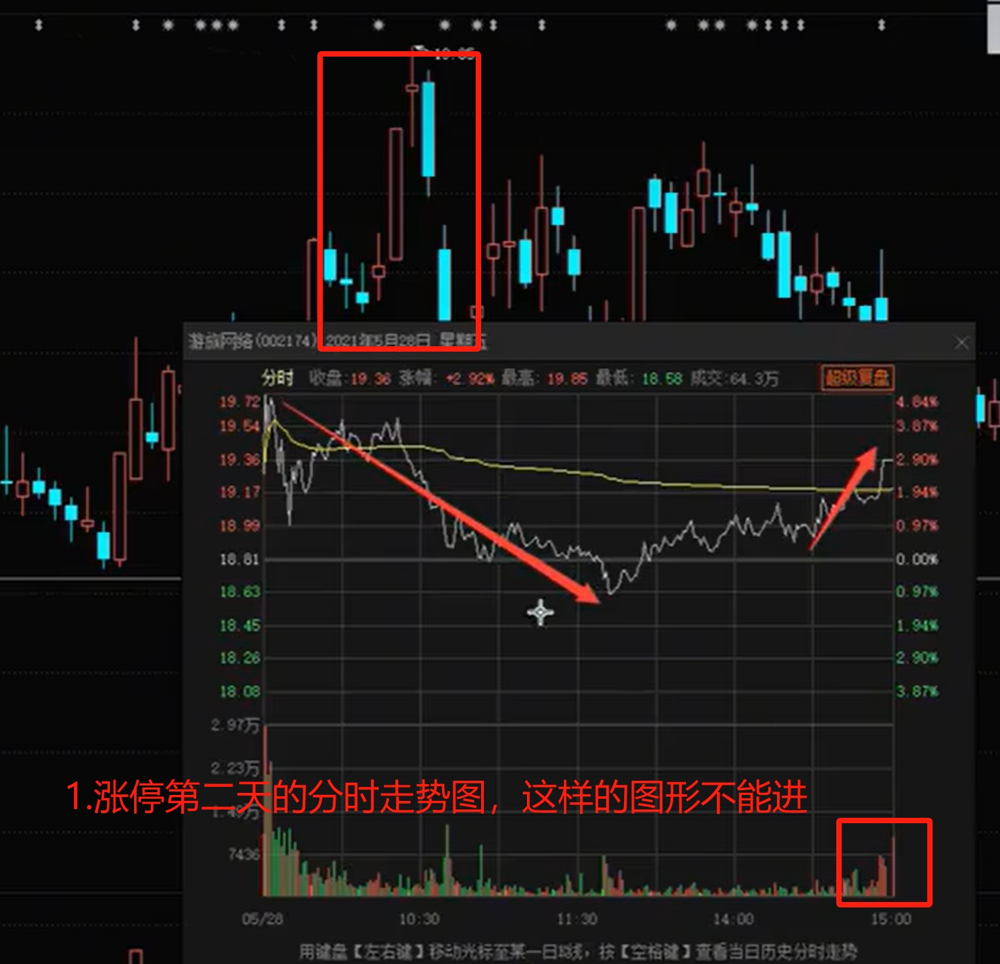

- 涨停的第二天，成交量翻倍的大阴线，但是第二天并没有涨停，说明第二天分歧较大
  - 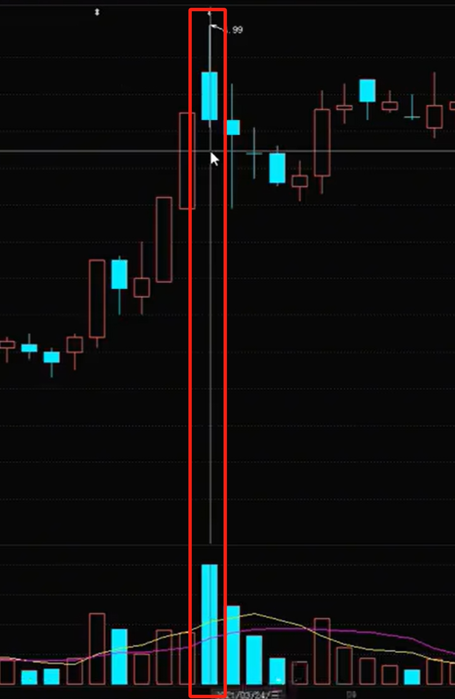

- 场景3：冲高回落。主力上午吸筹，下午拉升，最后出场
  - 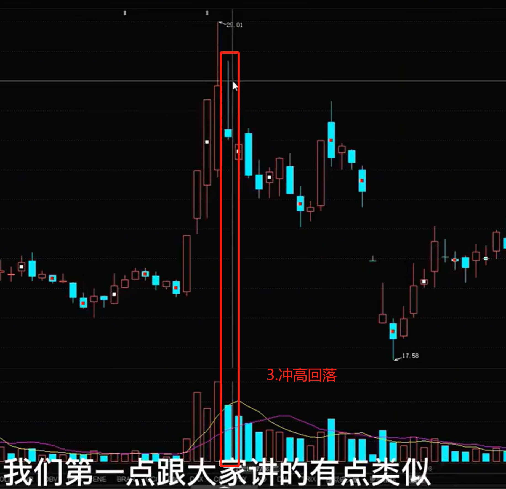

- 冲高回落
  - 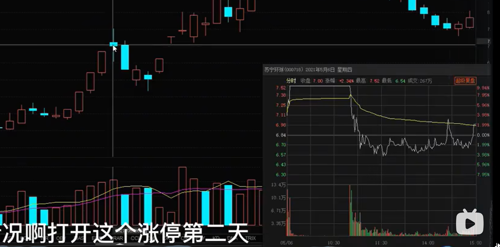

- 专治打板户
  - 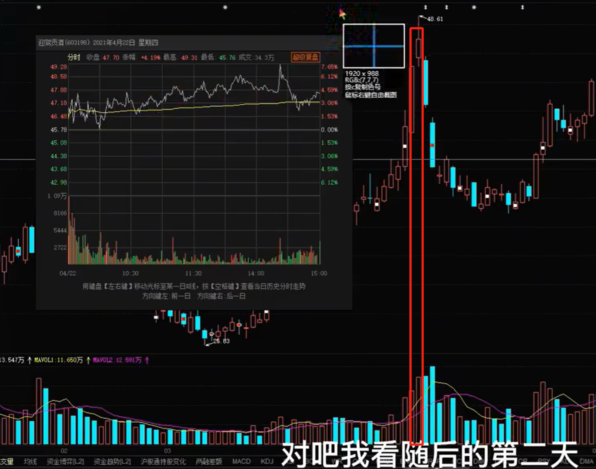

### 换手率

- 什么是换手率
  - 比如市值为100亿的股票，今天的成交额为10亿，那么它的换手率是10%
- 换手率低于1%
  - 活跃度很低，上涨空间慢
- 换手率在1%~3%
  - 活跃度适中
- 3%~8%
  - 活跃
- 8%~15%
  - 非常高；有主力介入，热门题材股票
- 大于15%
  - 过高，有主力出货；赶紧跑路
- 高位换手率大于25%
  - 主力出货，赶紧跑路
- 主力吸收散户筹码，换手率很低成交量自然也很低，散户一直在卖，换手率越来越萎缩

### 龙首阴战法

- 啥意思：龙头股首次出现大阴线

- 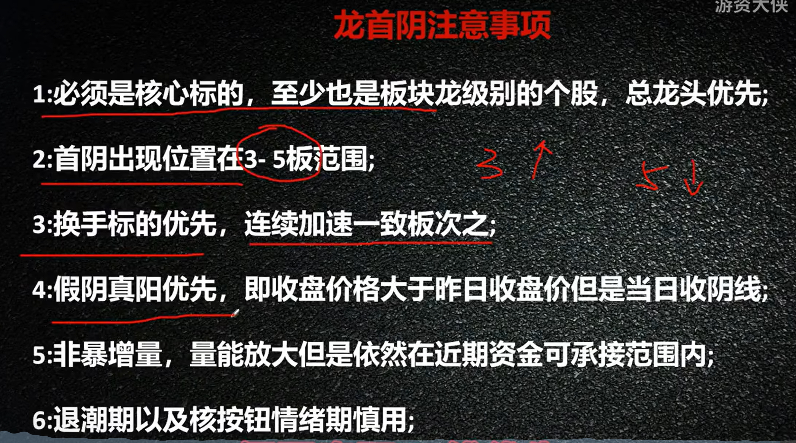

### 涨停三连阴

- 前一天涨停，但是涨停过程中不能是一字板，一定得有回落
- 第二天开盘价一定要比第一天收盘价高！
- 阴线一定是小阴线，且第三根阴线最低不能低于前三天涨停板的收盘价的2/3
- 并且三根阴线一定是阶梯缩量下跌，不能是放量下跌！
- 入场
  - 我们在第三天尾盘介入，最后5分钟进场
- 出场
  - 第二天我们赚了5左右就跑路了
- 涨停三连阴
  - 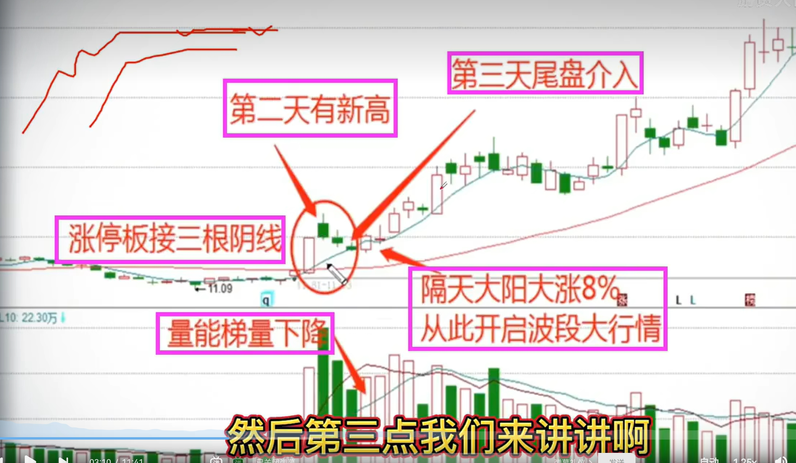
  - 分时图
    - 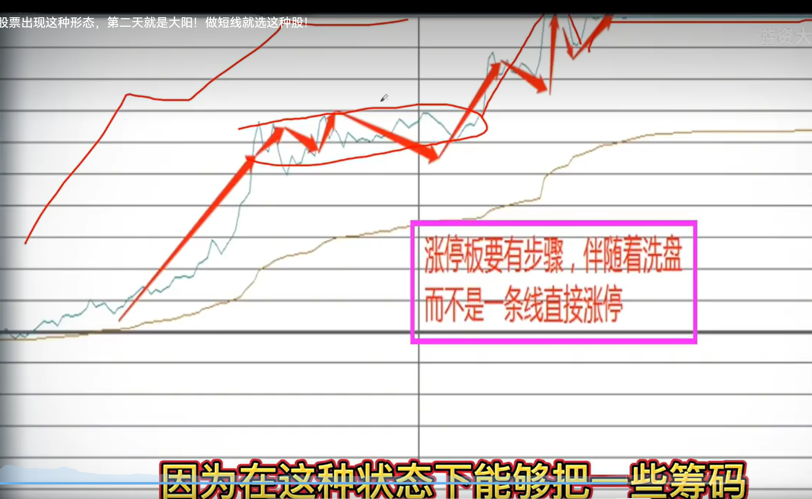

- 入场5分钟横盘
  - 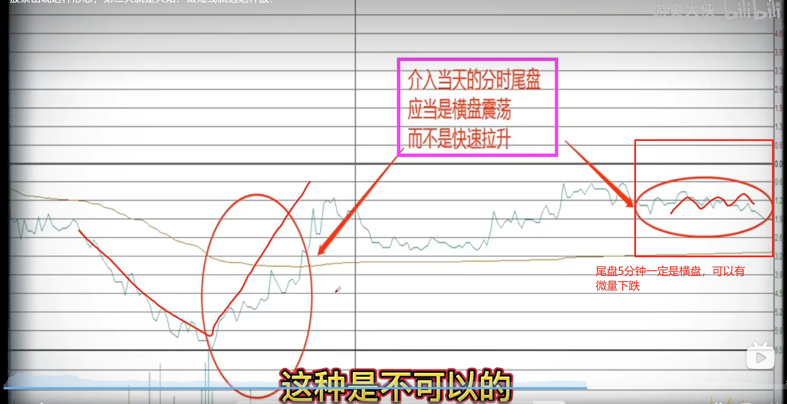

- 怎么快速找这类股票
  - 问财 ->近4个交易日有过涨停板，且第二天创出新高的股票
  - 提出ST股票和业绩比较差的股票

### 做T

- 日内做T
  - MACD背离是确定性较高的反弹点或回落点
  - 高抛低吸+顶背离
    - 股价在走高，成交量出现降低（成交量背离），MACD出现背离（高点在降低），可以做T卖出，盈利3个点就可以做T
    - 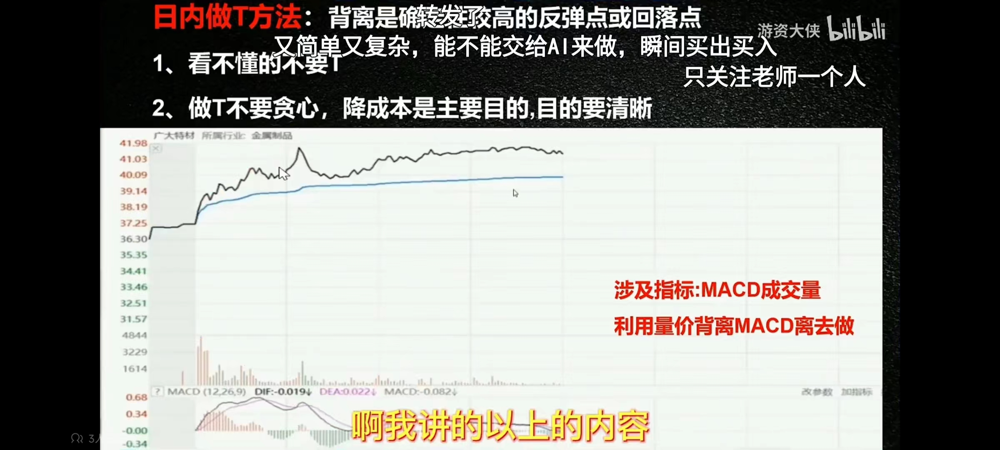
  - 低吸高抛 + MACD底背离
    -  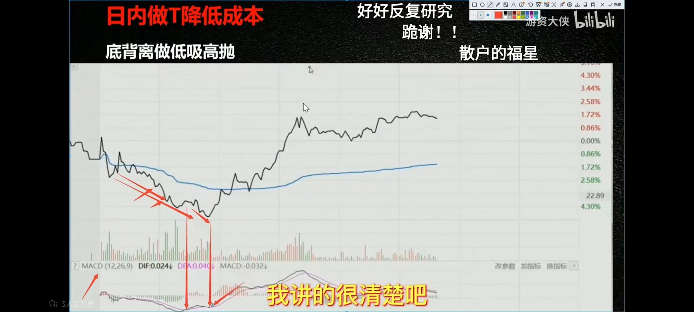

- V形反转 + 成交量是阳量且反包（成交量是大阳线）
  - 第二次股价下探没有创新低 + MACD指标在零轴附近
  - 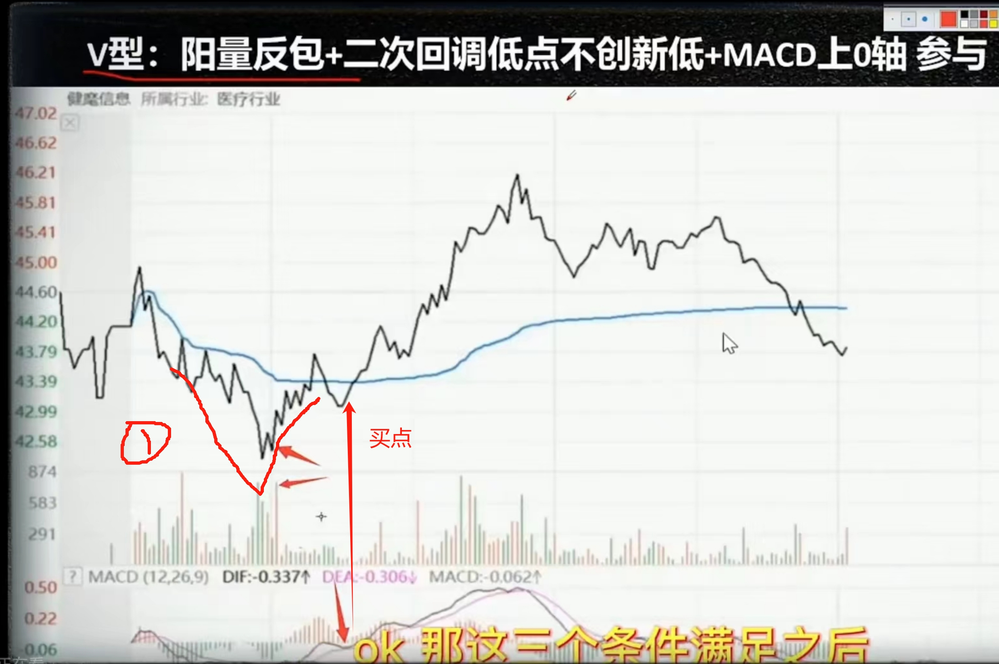

- 做T遵循：**趋势为王，顺势而为！**
  - 日线如果是多头趋势，顺向做T，先买后卖！
  - 日线是空头趋势，先卖后买
  - 一般刚开盘15分钟，市场比较情绪化，等到9:45以后才大概率知道股票怎么走

### 个股大涨前信号

- 1% ~ 3%振幅增至5%及其以上
- 日换手率从1%~3%增至3%~8%，甚至10%以上
- 个股好坏消息，行业消息也增多
  - 突破箱体
  - 

### 量价背离
- 缩量下跌，表明大家一致看跌的人少！**缩量股价创新高**但是成交量没有创新高，表明前面盘已经洗干净了，少量的资金就可以驱动上涨，并不是后面股价会跌。
- 

### 主力高位出货
- 2和3号放量滞涨，并且2-7号都出现上影线，表明主力在出货，散户得赶紧跑路！
- 

