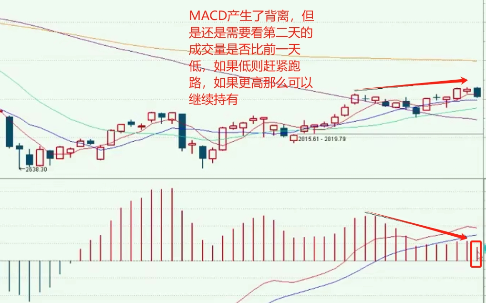
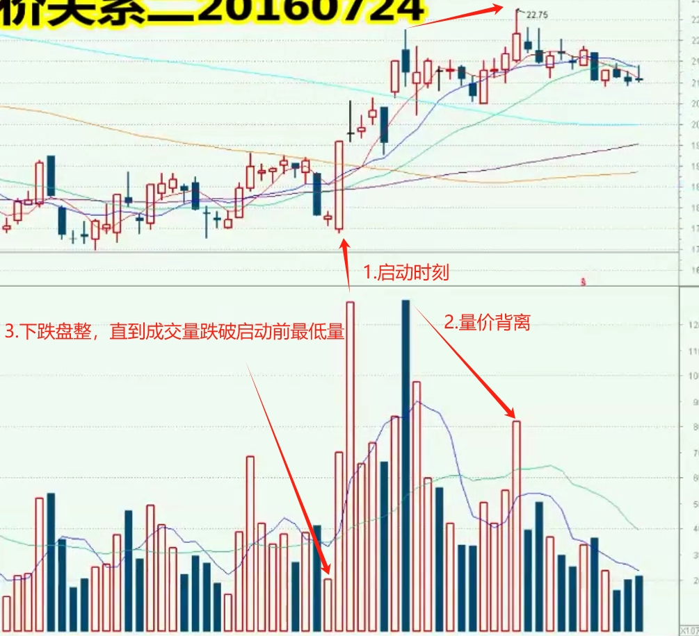

# 长颈鹿的股票课堂

## K线

- 跳空缺口

  - 向上攻击

- 大阳线

  - 出现在底部，向上攻击
  - 出现在顶部，小心主力出货

- 锤子线

  - 下影线的长度是实体的2倍长，实体上方没有上影线最好  
  - 顶部阴线锤子线，如果第二天上涨，三天之内会见到一个新的高点！
  - 
  - 

  - 

  - 

- 黄昏星
  - 第一天收阳，第二天跳空缺口（跳空缺口阴阳都无所谓），第三天收阴刺入前期的大阳线，后面要走跌
    - 

启明星

- ​	股价下跌过程中，当天收大阴线，第二天跳空，第三天收阳并且刺入第一天的阴线中，表明未来走势往上
  - 

三天两跳空

- 表明股价反转明显；出现在顶部赶紧跑路，出现在底部可以入场
- 

流星线

- 股价在上涨过程中，第一天大阳线，第二天出现流星线，那么第二天赶紧跑路，接下来股价会发生反转
- 

孕线和吞没

- 

刺透线

- 下跌过程中，第二天的阳线顶部穿过了第一天阴线的一半，说明接下来股价会上升
- 上升过程中，第二天阴线最低点跌破了第一天的一半的位置，说明接下来股价会下跌
- 

持续形态

- 下跌过程中，如果第二天阳线没有插入第一天阴线，或者第二天阳线

## 形态

- 头肩顶
  - 
- 头肩底
  - 

### 三角形

- 对称收敛三角形
  - 至少走出4个点形成支撑和压力位，一半6个点形成之后股价才会拉升
  - 
  - 三角形突破时间极限
    - 如果超过3/4位置才突破，那么向上和向下都是假的
    - 在1/2 ~ 3/4突破才是有效突破
      - 

- 上三角形和下三角形
  - 向上突破：股价拉升成交量放量，股价下跌，成交量缩量
  - 
  - 

### 过滤器

- 满足三条件
  - 收盘价突破
  - 突破颈线1%~3%
  - 在颈线上面站稳至少3天
  - 

## 均线

- **认清大盘趋势，跟着大盘走，多头还是空头排列**
- 均线有多头（上涨）和空头（下跌）排列
  - 空头排列
    - 小级别均线在大级别均线下方，比如5日均线在10日和20日下方
  - 多头排列
    - 小级别均线在大级别均线上方，比如5日均线在10日和20日上方
  - 严格意义上的多头排列
    - 所有均线都向上，并且小级别均线在大级别均线之上
    - 
    - 做个股看周线，选择5日，10日，20日
  - **黄金交叉是买点即金叉**
    - 5日均线和10日均线都向上并且5日均线上穿10日均线
    - 10日和20日比较，并且带动更大级别的均线上涨才可以（60日，120日均线）
  - 死亡交叉是卖点即死叉
    - 5日均线和10日均线都向下并且5日均线下穿10日均线
  - 飞吻和唇吻可以继续持有（主力在洗盘，不想让散户进场），但是高点舌吻（主力在出货）一定要跑路！
    - 

- 预测明天5日均线的均线位置均线抵扣
  - (当天前4天的价格 - 当前的价格)/5 = x；当前的价格 - x = m；那么m就是明天的5日均线的价格
- 均线如果发生交叉那么在当日价格一定会发生共振
- 缺口
  - 一日补缺9生一死，三日补缺半生半死，5日补缺9死一生
- 啤酒饮料花生瓜子八宝粥，白酒
  - 找出日线，周线，月线是否有多头排列的，有的话可以关注
- 选个股
  - 个股的日，周，月线都是严格意义的多头排列，而且大盘指数也是多头排列

## 均线2

- 均线设置，5,10,20,60
- 买点：
  - 股价在一个强势的上涨周期中，大盘也在上涨，回踩跌破5日均线就是一个不错的买点
  - 
- 20日均线-生命线
  - 线上不做空，拉回找买点
  - 线下不做多，拉回找卖点
- 60日均线
  - 60日下方是不景气的情况，赚到10到15个点就需要离场！
  - 60上方才是好的情况

### 指数平均线-EXPMA

- 设置为12和50
  - 行情好的时候快线和慢线形成金叉，价格回踩快线就是买点
  - 同时成交量大于5日平均值，那么价格才能够站得住5日均线
    - 有量才有价，无量无价
- A股市场的原油波动紧密相关，和汇率波动也相关


## KD随机指标

- 价格在20日均线之上，KD金叉是买点
- D线80以上是超买，20以下是超卖
- K线90以上是超买，10以下是超卖
- J线90以上波动数天是超买，10以下波动天数是超卖
- 超买和超卖代表接下来股价会波动特别大
- KD具有滞后性，KD值在50到80之间是一个强势状态，变化跟价格变化一样。但是KD超过80以后，KD变化幅度远小于股价。

#### KD背离

- 股价在升高，但是K线波峰却在降低，是卖点
  - 
- 需要注意的是尽管KD日线发生背离，但是如果KD的周线还是在上升的过程中，那么此时日均线只是一个回调，当KD周线走完一个波峰并且KD日线发生两次背离，那么股价会走低，赶紧出手
- KD大于50进去强势区反之

#### KD循环

- KD周期循环，从最近最高点产生三次死叉过后，接下来走三次空方循环还是三次多方循环？
  - 股价在下跌过程中：下一次死叉过程是否破了新低，如果是的话就是空方循环。看60分钟线，3 -> 6 -> 9 次循环；第6或者9次可能就是股价最低点，这个时候再回去看日线级别的KD，看是否有背离。
  - 股价在上涨过程中：下一次金叉是否创了新高，如果是的话，接下来3次循环就是多方循环；看60分钟线，3 -> 6 -> 9 次循环；第6或者9次可能就是股价最高点，这个时候再回去看日线级别的KD，看是否有背离。
- 在股价上涨过程中，日线KD有三个金叉和三个死叉，第三次金叉之后，股价很可能是横盘或者是回调。接下来再一次KD的死叉那么就是KD的循环又开始了。入场的过程是第一第二个金叉。
- 股价最低点KD第一次金叉开始算，第三次金叉走完过后需要看接下来走空方的三次死叉还是走多方的6次金叉
  - 看第四次金叉是否创新高，如果是，那么还会走3次上升的金叉，如果后面失败，比如第三次金叉股价降低了，那么重置KD循环从死叉开始算（因为股价降低了）
    - 
- 也有可能日线的KD循环过程中会有6个金叉，因为周线KD的上升还没有走完。

##### KD循环失败

- 出现在金死叉第三次，第6次，第9次,第12次。失败了就重置，接下来股价上升就第一次金叉，股价下跌就是第一次死叉。
- 如果金叉死叉范围较小，就算为上一次的
  - 

-  **周线级别的金叉过程股价通常是要涨9周或者是8周或者10周**
  - K线从波峰到波谷的一个过程，或者波谷到波峰的过程
- KD钝化
  - KD在80以上同时成交量持续放大，钝化会持续，同样KD在20以下持续数日宝随着成交量下跌，也会出现钝化现象
  - 钝化的原因是周线和月线的的趋势没有走完
- **买点1**
  - 股票均线是多头向上，并且股价在20日上方KD日线形成死叉，此时KD的小时线（60分钟线）KD形成金叉就是买点。
  - KD的月周线都是向上的过程，并且日线刚好产生了三次死叉，周线即将产生金叉，再看小时KD，当产生多头三循环的时候就是买入点
  - 右侧买点：风险小，**金叉的位置离最近股价最低点不要超过3天，超过3天会有风险。**包含股价最低那天。
  - 左侧买点
    - **多头趋势才可以抢买点**
    - 风险大一点，**K值小于50**，并且当天收一个反涨的阳线，当天收阳，K值却向下。
    - **第二天收盘破了第一天阳线的高点，是一个明确的上涨机会。**
    - 
  - 买点2
    - KD周线将要金叉并且KD日线在低档产生背离，再看60分钟的KD,如果即将要产生金叉，立即看KD5分钟的指标，如果这5分钟持续在20以下持续钝化，那么这5分钟都是买点！！！
    - 股票符合均线强势背景，KD月和周线都是金叉往上走的过程并且股价在20日均线之上并且日线KD是死叉（日线死叉三循环走完了），那么再找找60分钟KD金叉即买点！
  - **卖点**
    - KD相邻两个波峰均线最近股价创新高，但是KD相邻波峰却在下降，此时需要减仓，再看看周线上涨趋势走完没，没走完可以再等等后面二次背离进行空仓处理，如果周线走完也立即清仓处理！

## MACD

- 指标设置
  
  - 12,26,9
- MACD死叉到金叉，金叉到死叉周期
  
  - 10到12天为基准，如果发现时间快到了不会产生金叉或者死叉那么再加12n(n>=1)
  - 或者3个周期，3个周期是用来修复的指标的。
- 多头控制与空投控制
  - MACD快慢线在零轴线上方是多头掌控区域，比较强势。
  - MACD快慢线在零轴线下方的空投掌控区域

- 多方掌控区间与空方掌控区间
  - 多方掌控区间：MACD金叉到死叉的过程
  - 空方掌控区间：MACD死叉到金叉的过程

- 主力吸筹

  - 几分钟内，放量上攻，缩量回调

- 使用

  ```
  注意：macd金叉指标必须结合均线多头股票在强势背景下才能使用
  如果股票是弱势背景，熊市，前面股价上涨了20个点或者10天，金叉很可能后面很快回调。
  右侧交易：鸭子张嘴图形，金叉后，快线回调，后面强势上涨！金叉和张口的过程不要超过5天！！！
  熊市买点：金叉之后，往下行成死叉，之后马上又行成金叉，快速二次金叉，第二个金叉就是买点
  ```

- 买点

  - 熊市中产生两次金叉，第二次是比较好的买点

  - ```
    先看大盘预测大盘强势时间段，均线看趋势，kdj看循环，macd金叉向上不要超过5天
    
    月线周线均线严格意义多头排列
    月线周线macd金叉向上
    
    逢低买入，找macd60分钟金叉，kd走完3循环马上要金叉进行买入，macd或者kd60分钟出现背离进行离场卖出
    kd超买要注意跑路！kd超卖可以进去抢一波反弹
    1.一定一定要看大盘，大盘好的时候入场，2.找个股强势背景，月线macd是否金叉？月线均线是否多头排列？macd日线金叉5个周期内介入，因为一个循环是10-12个周期，越往后面介入越容易赔钱！3.基于上面条件继续找macd60分钟级别，空方掌控运行了10-12个周期，kdj运行了3次循环且马上产生金叉，这个时候就是买点。
    ```

### MACD背离

- macd背离：股价创新高，柱子却走低，不要急着卖！再看第二天柱子是否比前一天更低，如果不是就不用卖，如果是就看当天5分钟均线指标是否产生空头排列，是的话就卖掉。
- 有背离股价就有反转，赶紧跑路
  - 

## 费氏数列

- 黄金分割比例位0.382，0.5，0.618是上涨过程中的压力位或者也是下跌过程中的支撑位
- 斐波那契数列是买点或者卖点的周期，这一套必须结合前面的均线 kdj macd理论
  - 3,5,8,13,21,34,55,89
- 波浪理论
  - 推进是5波，回调是3波
  - 如果是熊市的周期中，推进的下跌浪通常是5波，回调是3波，回调的幅度通常是0.382,0.5，0.618

- 斐波拉契数列通过更大级别的观测我们来预测股价的波动，结合以前的三套理论使得我们投资更加准确
  - **先看周线**
  - 画线 -> 斐波拉契线
  -    

#### 黄金分割

- 画图工具里面选择黄金分割线，从最近最低点到最高点，0~100%
- 重点关注0.382,0.5,0.618

## 量价关系

- 底部打底：峰量且出过几次报量说明是底部
- 腰部爆量：出现一次爆量之后，接下来3到5个交易日得再出现一次爆量并且成交量没有急速萎缩，未来才有可能继续往上涨。
  - 那如果前期放量高点在接下来很长一段时间中都没有突破前一个高点的量，那么很可能短期做头的迹象，量价背离赶紧跑路。
  - **腰部过程中，量比价先行！**
- 缩量
  - 股价在下跌过程中，在一个平台缩量盘整，通常这个平台是用来跌破的。
- 多空量
  - 5 & 20 日均量线
  - 多空量上方：大于20日均量线
    - 某一日量在多空量上方，但是接下来3日量又回到了多空量下方，这个时候不是介入时机。
  - 多空量下方：小于20日均量线
    - 股票多日的成交量在多空量下方，某一日出了一根中阳线(股价上涨3%~6%)，但是改日的量没有突破多空量上方，也不能介入！
- 上攻5日，20日均线价格
  - 成交量也要超过5日均量；成交量也要超过20日均量。
  - 什么时候算是攻击成功了？
    - 站上那个价格3天，并且这3天内需要把量补上，如果量没有跟上，后面还会跌下去。
- 本周收阴线还是阳线
  - **看的是成交额，成交了多少钱**
  - 如果本周成交量大于上周，那么回收阳线。不一定绝对，但绝大多数情况是这样。
  - 如果本周成交量小于上周，那么要收阴线，如果没有收阴线，下周一，二一定要放量，如果不放量的话那么就是量价背离，股价一定会发生反转。但绝大多数情况是这样。
- 打底过程
  - 大底放量又缩量，上下游走要忍耐
- 突破压力过程，行情启动过程
  - 放量破线缩量踩（放量破压力位，后面价格回踩压力位），量创新高便启动
  - 
- 量坑洗盘为再涨，一坑更比一坑高
  - 股价在上升过程中，量坑应该越来越高，如果量坑变低后面需要注意跑路
- 高档爆量若不涨，或者背离则见顶
  - 高档爆量但是短期内（3天左右）没有创出前爆量的新高是不好的信号
  - 或者量价背离则赶紧跑路
- 放量攻过形态（0.618黄金分割比例为），高点必被突破
- 上证集合竞价超过15亿，当天多半是放量状态


### 挑选HS300股票

- 通信达 -> HS300 -> 挑选里面的股票操作

### 短期见底的条件，注意不是买入点

- 量价背离股价下跌，跌破启动点最低成交量的时刻就是短期见底的时刻。
- 


## 限售解禁

- 了解股票的限售解禁时间，如果快到的话，千万别碰，千万别买！


## 快捷键

- 条件选个: ctrl + t
- 某个股票加入板块：ctrl + z
- 个股属于某个板块：ctrl + r
- 公式菜单：ctrl + f
- . 402 功能：查看板块强度排名
- 400 功能：板块分析
- .909 功能：综合选股。
- .905: 条件选股
- .933：盘后数据下载
- 专业财务数据下载需要付费版的通达信，一年315.
- 清空自选股
  - ctrl + t  -> 选股入板块 -> 清空品种
- 查看上证指数
  - F3
- 月线mo,周线w，日线d，小时m60
  

### 公式

- 自定义公式选股
  - ctrl + f -> 条件选股公式 -> 基本面 -> 新建 -> 插入函数 -> findone()

- 2023年3季报净利润增长率大于5% 
  - findone(184,2023,0930) > 5
- 最近一个季度的净利润增长率(code -> 184)大于5%
  - findone(184,0,0) > 5

## 挑选沪深300指数里面的都是均线都是多头向上的股票

- 板块 -> 指数板块 -》沪深300 -》选中全部 -》加入到板块（自选板块或者是新建板块）
- ctrl + t提交选股 -》选择周期月，周，日 -》 改变范围 -》自选股

# 短线交易系统

- 先看大盘走势，上行走势，月，周，日
- 个股是强势背景
  - 月，周，线的均线符合严格意义多头排列
- KD
  - KD周线即将形成金叉，日线金叉或者即将形成金叉
  - KD在底部产生金叉最好
  - 周期为9 +/- 1天
- MACD
  - 金叉或者即将产生金叉，周期是10-12 + 12n

- 成交量
  - 关注成交量，注意卖点！
  - 走上升过程中，量比价先行
- 费氏数列和黄金分割
  - 周和日以及60分钟的线调试出来，观察十字交叉点以及压力支撑位

- 沪深300里面并且是均线多头向上
- 交易软件
  - 通达信
  - 同花顺
    - 看外汇，看黄金